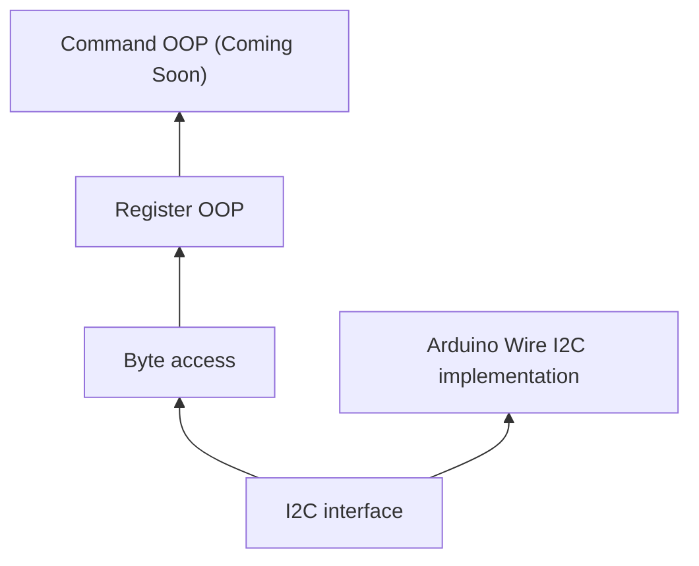

# HUSB238A
This is a C++ focused library for the HUSB238A, featuring 3 levels of access with a modular I2C interface.
* No dynamic memory allocation


# Quick example
```cpp
#include "HUSB238A.hpp"
using namespace husb238a;

const HUSB238A h238a(VDD);  // A connection to the 238A via default VDD I2C address
```
1. Byte access - You have full control over the register data and address
```cpp
#include "inc/ByteAccess.h"  // Recommended - One header for the entire ByteAccess layer

uint8_t byte_control1 = h238a.read_register_byte(CONTROL1);
if (get_bit(byte_control1, field::ENABLE) == 0) {  // Get ENABLE field
    byte_control1 = set_bits_1(byte_control1, field::ENABLE);  // Set ENABLE field to 1
}

// Handy converters for human integer <-> field binary values
#include "inc/Conversion.hpp"
byte_control1 = set_bits_n(byte_control1, field::TCCDEB, cvsn::to_tccdeb(120));  // Set the debounce to 120ms

// Some field values (fval) are constants. fval::NAMESPACE::CONST provide them like enums.
uint8_t go_cmd = h238.read_register_byte(GO_COMMAND);
go_cmd = set_bits_n(go_cmd, field::GO, fval::GoCommand::SELECT_PDO);  // Set GO field to SELECT_PDO (0b1)

// You have to perform a write action in order to actually update the register
h238a.write_register_byte(CONTROL1, byte_control1);
// You can write any value to any register - Error prone
h238a.write_register_byte(CONTROL1, 0x69);
```
2. Register OOP - Register address is fixed, you can access a register by its fields
```cpp
#include "inc/RegOOP.h"  // One header for the entire RegOOP layer
#include "inc/Conversion.hpp"

Control1 control1;  // Address is fixed in the class
h238a.read_register(&control1);
control1.get_val(); // All RegOOP classes have a get_val() that retrieves the full byte
if (!control1.enable()) {  // Get ENABLE field
    control1.enable(true);  // Set ENABLE field
}
control1.tccdeb(cvsn::to_tccdeb(120));
h238a.write_register(&control1);

GoCommand go_cmd;
go_cmd.go(fval::GoCommand::SELECT_PDO);

// Some classes are shared by multiple registers. They have an internal enum that you must use
// to initialise those classes
SrcPDOXXV src_pdo_5v(SrcPDOXXV::V5);

PortRole portrole; // Some registers are read-only
h238a.read_register(&portrole);  // OK
h238a.write_register(&portrole);  // Error - read-only register
```

# Setup
In most devenv you should be able to just drop the entire repo in your library root folder and it should work.
I test with PlatformIO, which you can write the following in `platformio.ini`:
```ini
lib_deps =
    https://github.com/Pythonic-Rainbow/HUSB238A
```


# I2C
`I2C.hpp` defines methods to communicate with the HUSB238A via I2C.
You have to provide an implementation. A default implementation for Arduino Wire is provided in this repo.