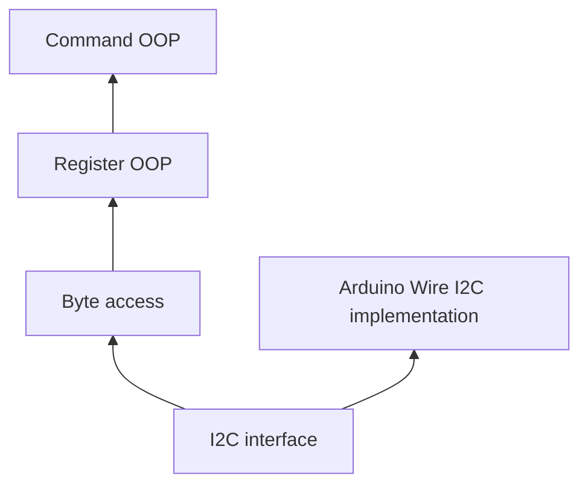

# HUSB238A
This is a C++ focused library for the HUSB238A, featuring 3 levels of access with a modular I2C interface.


# Quick example
```cpp
#include "HUSB238A.hpp"
#include "ByteUtil.hpp"

using namespace husb238a;

const HUSB238A h238a(VDD);  // A connection to the 238A via default VDD I2C address

int main() {
    // 1. Byte access - You have full control over the register data and address
    byte byte_control1 = h238a.read_register_byte(CONTROL1);
    byte_control1 = set_bits_1(byte_control1, regdetail::ENABLE);  // You can change the entire byte
    h238a.write_register_byte(CONTROL1, byte_control1);  // You can even write it to another address
    
    // 2. Register OOP - Register address is fixed, you can access a register by its fields
    Control1 control1;  // Address is fixed in the class
    h238a.read_register(&control1);
    control1.enable(true);  // Access by fields
    h238a.write_register(&control1);
}
```

# Setup
In most devenv you should be able to just drop the entire repo in your library root folder and it should work.
I test with PlatformIO, which you can write the following in `platformio.ini`:
```ini
lib_deps =
    https://github.com/Pythonic-Rainbow/HUSB238A
```


# I2C
`I2C.hpp` defines methods to communicate with the HUSB238A via I2C.
You have to provide an implementation. A default implementation for Arduino Wire is provided in this repo.